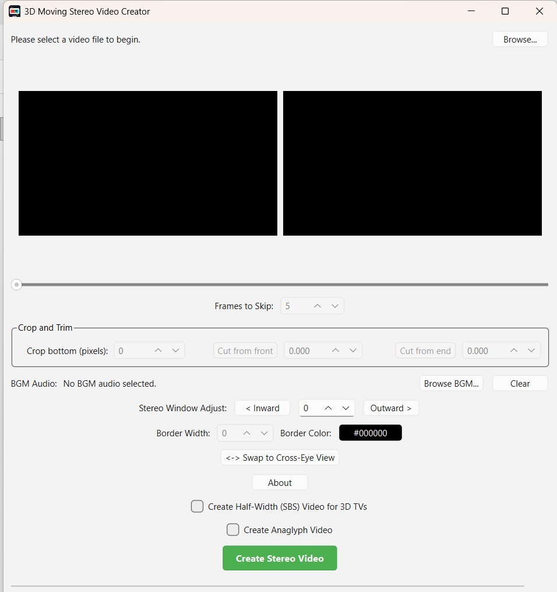

# 3D Moving Stereo Video Creator



3D Moving Stereo Video Creator is a native Windows Qt application for converting suitable moving-camera video into 3D video output.

It is mainly intended for video captured from a moving train or car while the camera is kept steady, without horizontal shifting or tilting left or right. By taking the left and right eye views from frames separated by a configurable skip value, the app can simulate a stereo camera effect when the scene has stable motion and not too many fast moving objects.

## Features

- Side-by-side preview of left and right eye frames.
- Anaglyph preview when anaglyph output is enabled.
- Configurable frame skip for generating the left/right eye separation.
- Input orientation control: `Auto`, `Portrait`, and `Landscape`.
- Front and end trimming with frame-slider shortcuts.
- Bottom crop.
- Stereo window inward/outward adjustment.
- `Swap Views` control for switching left/right eye order.
- Full side-by-side output.
- Half-width SBS output for 3D TVs.
- Red/cyan anaglyph output.
- Optional border with configurable width and color.
- Video info panel showing `(W x H)` input, adjusted eye, output, final scaled size, and scaling mode.
- Save As prompt before export, with a generated default filename.
- Config dialog for BGM and output scaling.
- Optional BGM audio replacement. If a BGM file is selected, it replaces the source audio.
- BGM is looped and trimmed to the exact output duration.
- Final output scaling by percent, target width, or target height.
- US-English numeric formatting independent of Windows regional settings.

## Requirement

FFmpeg must be available in the system `PATH`.

The app also tries `D:/stereo/ffmpeg.exe` as a fallback, but the recommended setup is to add FFmpeg to the Windows `PATH`.

## Build

This project uses Qt 6 Widgets and CMake.

Example build using the Qt installation layout used during development:

```powershell
$env:Path='D:\Qt\6.11.0\mingw_64\bin;D:\Qt\Tools\mingw1310_64\bin;D:\Qt\Tools\Ninja;' + $env:Path
& 'D:\Qt\Tools\CMake_64\bin\cmake.exe' -S . -B build-qt -G Ninja -DCMAKE_PREFIX_PATH='D:\Qt\6.11.0\mingw_64' -DCMAKE_BUILD_TYPE=Release
& 'D:\Qt\Tools\CMake_64\bin\cmake.exe' --build build-qt --config Release
& 'D:\Qt\6.11.0\mingw_64\bin\windeployqt.exe' --release .\build-qt\3DMovingStereo.exe
```

## Release Package

The Windows release zip contains `3DMovingStereo.exe` and the required Qt runtime DLLs/plugins. FFmpeg is not bundled; install FFmpeg separately and keep it in `PATH`.

## License

MIT License. See [LICENSE](LICENSE).
